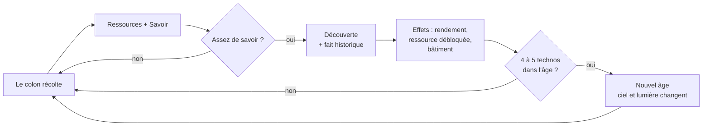
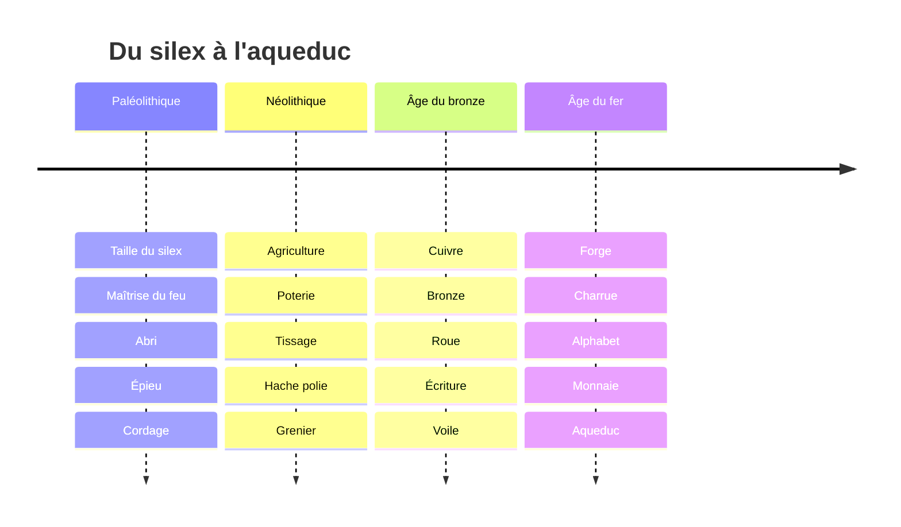
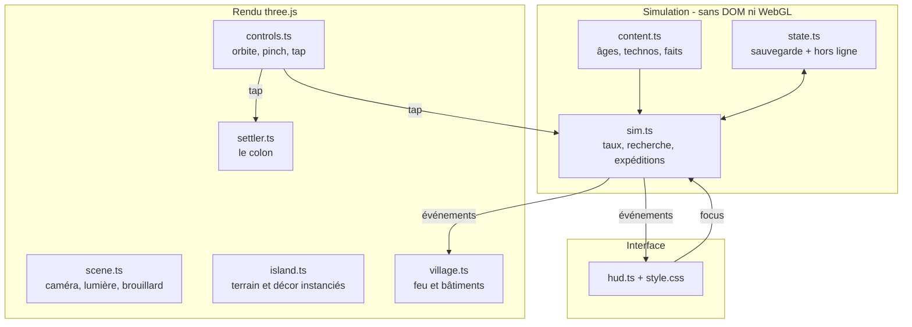

# Tribu

> Un jeu idle en 3D. Un colon, un feu, et 300 000 ans à traverser.

**En ligne : [tribu.battistella.ovh](https://tribu.battistella.ovh)** · Progression du chantier : [/progress](https://tribu.battistella.ovh/progress/)

Tribu est un jeu d'attente (*idle game*) qui tient dans un onglet et se joue au pouce.
Un seul colon débarque au Paléolithique. Il chasse, ramasse du bois, casse des cailloux,
et à mesure que le savoir s'accumule, la tribu découvre des technologies qui la font
basculer d'un âge à l'autre — jusqu'à l'aqueduc romain.

Chaque découverte livre **un fait historique réel** : la corde néandertalienne de
l'Abri du Maras, les épieux de Schöningen, la hache en cuivre d'Ötzi. C'est la
récompense du jeu autant que le bonus de production.

## Ce que le joueur fait (et ne fait pas)

Le jeu se joue tout seul. Le joueur n'est **pas** nécessaire — il est invité.

| Il peut… | Effet |
|---|---|
| Taper sur un arbre, un rocher, un buisson | Le colon y va, la production bascule sur cette ressource |
| Taper sur le colon | Il redouble d'ardeur : ×2 pendant 15 s, puis 45 s de repos |
| Lancer une expédition | 10 🍖, ~90 s, revient chargé — et parfois avec une trouvaille à regarder |
| Ouvrir « Savoir » | Dépenser des points de savoir pour une technologie, et lire son fait historique |
| Fermer l'onglet | La tribu continue, jusqu'à 8 h de progression hors ligne créditée au retour |

## Boucle de jeu



## Les quatre âges



## Architecture

La simulation est **découplée du rendu** : l'économie est un modèle de taux par
seconde, ce qui rend la progression hors ligne calculable exactement. Le colon
n'est pas la source des ressources — il **mime** à l'écran ce que la simulation
produit. C'est ce qui permet à un jeu 3D de rester juste après huit heures d'absence.



### Décisions structurantes

- **Zéro asset externe.** Toutes les géométries sont procédurales, les icônes sont
  inline, aucune police distante. Le jeu entier tient en ~145 kB gzip, premier
  dessin sous la seconde en 4G simulée.
- **Instanciation systématique.** Terrain, arbres, rochers, buissons : quatre
  `InstancedMesh` pour toute la carte. Le budget est un plafond dur (≤ 60 draw
  calls, ≤ 120 000 triangles), vérifié à chaque round par `tools/shoot.mjs`.
- **DPR bridé sur mobile.** `Math.min(devicePixelRatio, 1.75)` sur pointeur
  grossier : c'est la différence entre 60 fps et 25 fps sur un Android milieu de gamme.
- **Contrôles maison plutôt qu'`OrbitControls`.** Un doigt oriente, deux doigts
  zooment, un appui court est un tap. Pas de translation : le village ne peut pas
  être perdu hors écran.

## Développement

```bash
corepack pnpm install
corepack pnpm dev        # http://localhost:5173
corepack pnpm build      # typecheck strict + bundle
```

### Captures et mesures

`tools/shoot.mjs` est le harnais de comparaison : il capture les mêmes viewports
que la référence et relève les métriques objectives.

```bash
node tools/shoot.mjs https://tribu.battistella.ovh/ tribu-r2 --settle 8000
node tools/shoot.mjs https://oskarstalberg.com/Townscaper/ bar --net off --cpu 1 --settle 90000
```

Par défaut, notre build est mesuré **bridé** (4G simulée, CPU ×4). Le champ
`fpsSoftwareGL` est un signal relatif entre deux runs sur la même machine, jamais
une affirmation sur le GPU d'un vrai téléphone : le headless rend via SwiftShader.
Les chiffres qui font foi sont `firstDrawMs`, `calls`, `triangles` et
`transferredBytes`.

## Déploiement

```bash
cd /opt/docker/tribu
sudo docker compose up -d --build
```

Image multi-stage (Node 24 → nginx 1.29), servie derrière Traefik sur le réseau
`lan`, TLS Let's Encrypt via le challenge DNS OVH. La page de progression est
bind-montée depuis `/opt/docker/tribu/progress` : elle se met à jour sans
reconstruire l'image.

## Méthode : gauntlet loop

Le jeu n'est pas construit par itérations « jusqu'à ce que ce soit bien », mais
contre une **barre nommée et récupérable** : le build web de
[Townscaper](https://oskarstalberg.com/Townscaper/). Le travail est découpé en
pièces jugeables séparément ; pour chaque pièce, un builder produit et un critique
en contexte neuf ouvre les deux frames, les compare, en désigne une, et nomme le
seul plus gros écart restant. La boucle sort quand notre frame est choisie — pas
au bout de N rounds.

La technique vient de [Matt Shumer](https://github.com/mshumer) ; le skill est
packagé par [RoboNuggets](https://github.com/robonuggets/gauntlet-loop) et vit
dans `.claude/skills/gauntlet-loop/`.

**Limite assumée :** la comparaison n'est pas aveugle au sens strict. Townscaper
est un jeu connu, un critique attentif peut le reconnaître à sa palette. On
supprime les étiquettes et on impose un choix binaire, ce qui retire la note
complaisante — pas l'a priori.
